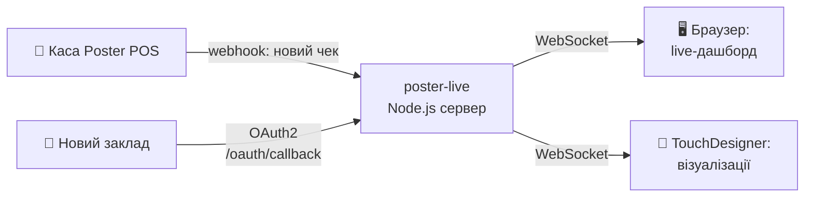

# Poster Live — Real-time POS Webhook Server

> **TL;DR (EN):** Node.js + WebSocket server that receives Poster POS webhooks and broadcasts each sale in real time to connected clients — a live browser dashboard and TouchDesigner visuals. Multi-store, OAuth2 onboarding, deployable on Railway.

## Що це таке, простими словами?

Уяви кав'ярню. Щоразу, коли бариста пробиває чек, каса вміє «гукнути» про це в інтернет — таке повідомлення називається *webhook*. Цей сервер — вухо, яке ті гуки слухає.

Почув «продали капучино за 95 грн» → тієї ж секунди передав усім, хто дивиться:

- **у браузер** — на живе табло продажів (відкрив сторінку і бачиш чеки, що прилітають самі, без оновлення сторінки);
- **у TouchDesigner** — програму для візуалізацій: можна, наприклад, щоб на стіні бару кожен проданий коктейль запалював анімацію.

Тобто ланцюжок такий: *каса → цей сервер → екран*. Затримка — секунди. Закладів може бути кілька одразу — кожен зі своїм ключем.



## Можливості

- Підтримка **кількох магазинів** через `config/stores.json`
- WebSocket broadcast → браузер + TouchDesigner
- OAuth2 підключення нового магазину через `/oauth/callback`
- Live дашборд на `/`
- Тест без реального вебхука: `/test`
- **Пісочниці** (`/taps`, `/emulator`) — генерують транзакції без реальних продажів
- **Візуалізації** (`/viz`, `/stage`) — живий потік і гра-лабіринт, керована покупками

---

## Сторінки

| URL | Що це | Для кого |
|---|---|---|
| `/` | Live-фід транзакцій списком | оператор |
| `/stage` | **Гра-лабіринт на весь екран** — фінальний вигляд | проекція для гостей |
| `/maze` | Той самий лабіринт + мапінг кранів і стрічка покупок | пульт оператора |
| `/viz` | Візуалізація живого потоку (назви, суми, метрики) | проекція для гостей |
| `/taps` | 12 кранів: клік збирає чек, «Відправити» шле його | пісочниця |
| `/emulator` | Випадкові чеки вручну або автоматично | пісочниця |
| `/connect` | Інструкція підключення TouchDesigner + схема даних | зовнішні інтегратори |

### Як влаштована гра

Кожна покупка = крок героя лабіринтом. 12 кранів мапляться на напрямки руху
(за замовчуванням по 3 крани на 4 основні напрямки, змінюється на `/maze`).
Кожна одиниця товару — окремий крок: дві пляшки = два кроки.

- **Ковзання вздовж стіни** — якщо напрямок закритий, герой іде найближчим
  відкритим, щоб кожна покупка давала видимий рух
- **Двері з ключем** — одне з 12 пив відмикає двері в наступну кімнату
- **Кімнати з біомами** — `ЛІС → ЗИМА → ПЕЧЕРА` циклічно, у кожної своя палітра
- **Фрукти-бонуси** — огляд, кроки, сяйво, підказка де двері

Ігрове ядро — `public/maze-core.js`, спільне для `/maze` і `/stage`. Воно нічого
не знає про Poster: ключ від дверей передається як `setDoorKey({ id, name })`.

---

## Швидкий старт

### 1. Встанови залежності
```bash
npm install
```

### 2. Налаштуй змінні середовища
```bash
cp .env.example .env
# Заповни POSTER_APP_ID, POSTER_APP_SECRET, POSTER_REDIRECT_URI
```

### 3. Додай магазин
```bash
cp config/stores.example.json config/stores.json
# Заповни account та token для кожного магазину
```

### 4. Запусти
```bash
npm start
```

---

## Перенесення на іншу машину

У git **немає секретів** — `.env` і `config/stores.json` у `.gitignore`.
Після `git clone` бракуватиме тільки їх та `node_modules`.

```bash
git clone https://github.com/SerhiiDubei/poster-live.git
cd poster-live
git checkout taps-viz
npm install
```

Далі створи `.env` з одним рядком — токеном магазину:

```bash
POSTER_TOKEN=<токен виду 738592:xxxxx>
```

**Де взяти токен** (будь-який зі способів):

1. **З Railway** — він уже там лежить у змінній `STORES_JSON`:
   ```bash
   railway link
   railway variables --service poster-taps --kv
   ```
2. **З адмінки Poster** — Налаштування → Інтеграції → API
3. **Зі старої машини** — файл `.env` у корені проекту

Перевірка, що все зійшлося:
```bash
npm start
```
У логах має бути `Кеш завантажено: ~1500 продуктів`. Якщо `0 продуктів` —
токен неправильний або Poster API не відповів (сервер зробить 3 спроби).

### Деплой з ноута

```bash
railway login
railway link
railway up --service poster-taps --detach
```

Прод-сервіс `poster-webhook` деплоїться автоматично з гілки `master`,
тому пуш у `master` одразу оновлює його. Гілка `taps-viz` на нього не впливає.

---

## Підключення нового магазину

### Спосіб А — Прямий токен (якщо є доступ до адмінки)

1. Зайди в Poster: **Налаштування → Інтеграції → API**
2. Скопіюй токен (формат: `748039:abcdef...`)
3. Додай до `config/stores.json`:
```json
[
  { "account": "demo-store", "token": "748039:xxx", "label": "Demo Coffee" },
  { "account": "newstore", "token": "999999:yyy", "label": "New Store" }
]
```
4. У Poster вебхук: **Налаштування → Інтеграції → Webhooks**
   - URL: `https://your-server.railway.app/webhook/newstore`
   - Подія: `transaction`

### Спосіб Б — OAuth (якщо підключаєш чужий акаунт)

Відправ власника магазину за посиланням:
```
https://joinposter.com/api/auth?response_type=code&client_id={POSTER_APP_ID}&redirect_uri={POSTER_REDIRECT_URI}
```
Після авторизації сервер поверне токен і готові інструкції.

---

## Що заповнити в developer.joinposter.com

> Потрібно **один раз** при першому налаштуванні:

| Поле | Значення |
|---|---|
| **App Name** | Будь-яка назва (напр. "Live Monitor") |
| **Redirect URI** | `https://your-server.railway.app/oauth/callback` |
| **Webhook URL** | `https://your-server.railway.app/webhook/{account}` |
| **Webhook events** | `transaction` (transaction.close) |

Після створення app отримаєш `App ID` і `App Secret` → вставляй у `.env`.

---

## Endpoints

| URL | Опис |
|---|---|
| `GET /` | Live дашборд |
| `POST /webhook/:account` | Poster webhook (по магазину) |
| `POST /webhook` | Fallback для першого магазину |
| `GET /oauth/callback` | OAuth callback |
| `GET /test?account=xxx` | Тест: надіслати останню транзакцію в WS |
| `GET /debug` | Стан конфігу і кешів |
| `GET /api/products` | Меню з кешу (для кранів і зовнішніх інструментів) |
| `GET /api/latest` | Остання транзакція як JSON (для інструментів без WS) |
| `GET /api/schema` | Приклад структури даних |
| `POST /api/emulate` | Згенерувати транзакцію; `{"cart":[{product_id,quantity}]}` — заданий чек |
| `POST /api/reload-menu` | Перечитати меню з Poster |

---

## TouchDesigner

WebSocket DAT підключається до:
```
wss://your-server.railway.app
```
Отримує JSON кожної транзакції з полями: `account`, `store_label`, `sum`, `products[]`.

---

## Docs

> Папка `docs/` — офлайн-копія публічної документації Poster API ([developer.joinposter.com](https://developer.joinposter.com)) для зручності розробки; це не авторські матеріали цього проекту.

| Файл | Зміст |
|---|---|
| [docs/02_authentication.md](docs/02_authentication.md) | OAuth2 деталі |
| [docs/04_webhooks.md](docs/04_webhooks.md) | Webhook payload format |
| [docs/06_products_menu.md](docs/06_products_menu.md) | Products API |
| [docs/07_orders.md](docs/07_orders.md) | Transactions API |
