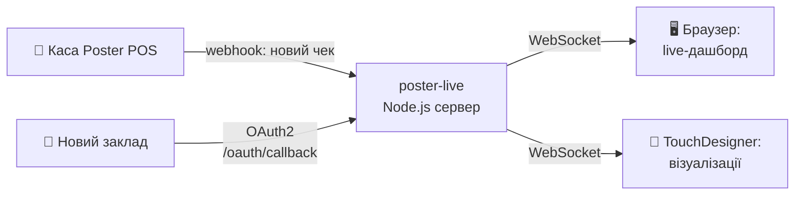

# Poster Live — Real-time POS Webhook Server

> **TL;DR (EN):** Node.js + WebSocket server that receives Poster POS webhooks and broadcasts each sale in real time to connected clients — a live browser dashboard and TouchDesigner visuals. Multi-store, OAuth2 onboarding, deployable on Railway.

## Що це таке, простими словами?

Уяви кав'ярню. Щоразу, коли бариста пробиває чек, каса вміє «гукнути» про це в інтернет — таке повідомлення називається *webhook*. Цей сервер — вухо, яке ті гуки слухає.

Почув «продали капучино за 95 грн» → тієї ж секунди передав усім, хто дивиться:

- **у браузер** — на живе табло продажів (відкрив сторінку і бачиш чеки, що прилітають самі, без оновлення сторінки);
- **у TouchDesigner** — програму для візуалізацій: можна, наприклад, щоб на стіні бару кожен проданий коктейль запалював анімацію.

Тобто ланцюжок такий: *каса → цей сервер → екран*. Затримка — секунди. Закладів може бути кілька одразу — кожен зі своїм ключем.



## Можливості

- Підтримка **кількох магазинів** через `config/stores.json`
- WebSocket broadcast → браузер + TouchDesigner
- OAuth2 підключення нового магазину через `/oauth/callback`
- Live дашборд на `/`
- Тест без реального вебхука: `/test`

---

## Швидкий старт

### 1. Встанови залежності
```bash
npm install
```

### 2. Налаштуй змінні середовища
```bash
cp .env.example .env
# Заповни POSTER_APP_ID, POSTER_APP_SECRET, POSTER_REDIRECT_URI
```

### 3. Додай магазин
```bash
cp config/stores.example.json config/stores.json
# Заповни account та token для кожного магазину
```

### 4. Запусти
```bash
npm start
```

---

## Підключення нового магазину

### Спосіб А — Прямий токен (якщо є доступ до адмінки)

1. Зайди в Poster: **Налаштування → Інтеграції → API**
2. Скопіюй токен (формат: `748039:abcdef...`)
3. Додай до `config/stores.json`:
```json
[
  { "account": "demo-store", "token": "748039:xxx", "label": "Demo Coffee" },
  { "account": "newstore", "token": "999999:yyy", "label": "New Store" }
]
```
4. У Poster вебхук: **Налаштування → Інтеграції → Webhooks**
   - URL: `https://your-server.railway.app/webhook/newstore`
   - Подія: `transaction`

### Спосіб Б — OAuth (якщо підключаєш чужий акаунт)

Відправ власника магазину за посиланням:
```
https://joinposter.com/api/auth?response_type=code&client_id={POSTER_APP_ID}&redirect_uri={POSTER_REDIRECT_URI}
```
Після авторизації сервер поверне токен і готові інструкції.

---

## Що заповнити в developer.joinposter.com

> Потрібно **один раз** при першому налаштуванні:

| Поле | Значення |
|---|---|
| **App Name** | Будь-яка назва (напр. "Live Monitor") |
| **Redirect URI** | `https://your-server.railway.app/oauth/callback` |
| **Webhook URL** | `https://your-server.railway.app/webhook/{account}` |
| **Webhook events** | `transaction` (transaction.close) |

Після створення app отримаєш `App ID` і `App Secret` → вставляй у `.env`.

---

## Endpoints

| URL | Опис |
|---|---|
| `GET /` | Live дашборд |
| `POST /webhook/:account` | Poster webhook (по магазину) |
| `POST /webhook` | Fallback для першого магазину |
| `GET /oauth/callback` | OAuth callback |
| `GET /test?account=xxx` | Тест: надіслати останню транзакцію в WS |
| `GET /debug` | Стан конфігу і кешів |

---

## TouchDesigner

WebSocket DAT підключається до:
```
wss://your-server.railway.app
```
Отримує JSON кожної транзакції з полями: `account`, `store_label`, `sum`, `products[]`.

---

## Docs

> Папка `docs/` — офлайн-копія публічної документації Poster API ([developer.joinposter.com](https://developer.joinposter.com)) для зручності розробки; це не авторські матеріали цього проекту.

| Файл | Зміст |
|---|---|
| [docs/02_authentication.md](docs/02_authentication.md) | OAuth2 деталі |
| [docs/04_webhooks.md](docs/04_webhooks.md) | Webhook payload format |
| [docs/06_products_menu.md](docs/06_products_menu.md) | Products API |
| [docs/07_orders.md](docs/07_orders.md) | Transactions API |
